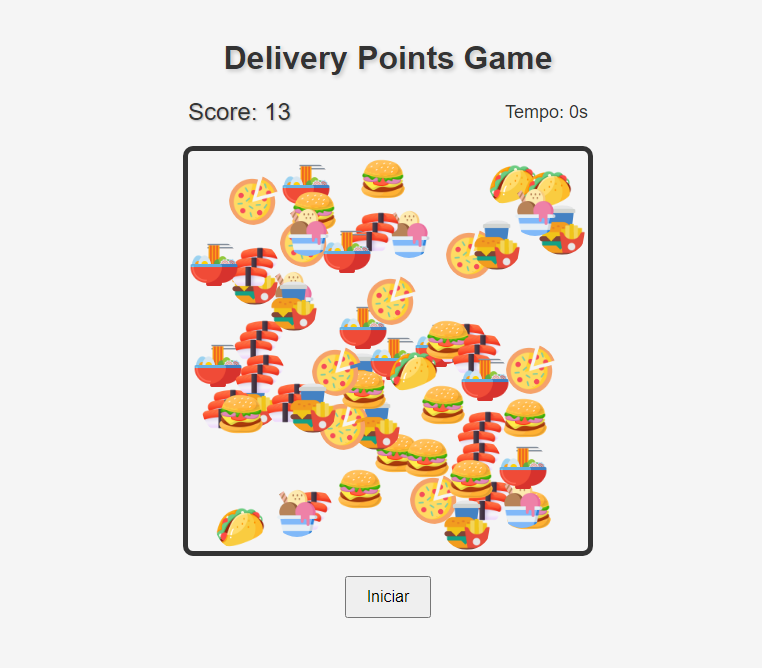

# Delivery Points Game - iWapin

Bem-vindo ao Delivery Points Game da iWapin! Desafie suas habilidades de coleta enquanto tenta marcar o máximo de pontos possível neste emocionante jogo.

## Funcionalidades

### 1. **Início do Jogo**

   Ao iniciar o jogo, você verá um tabuleiro de entrega com diversos pontos de comida para coletar.

### 2. **Coleta de Pontos**

   Clique nas imagens dos alimentos para coletá-los e ganhar pontos. Cada ponto contribui para a sua pontuação total.

### 3. **Temporizador**

   O jogo é cronometrado. Você tem um tempo limitado de 60 segundos para coletar o máximo de pontos possível.

### 4. **Animação Interativa**

   Os alimentos aparecem de forma animada e interativa. Cada clique em um alimento causa uma animação de escala, tornando a experiência mais envolvente.

### 5. **Pontuação**

   A pontuação exibida no canto superior esquerdo mostra a quantidade de pontos que você coletou.

### 6. **Fim do Jogo**

   O jogo termina quando o temporizador atinge zero. Uma mensagem de "Game Over" será exibida, mostrando sua pontuação final.

### 7. **Reiniciar o Jogo**

   Se quiser tentar novamente, clique no botão "Reiniciar" para começar um novo jogo.

## Desenvolvido por iWapin

Este jogo foi desenvolvido pela iWapin, uma empresa inovadora que busca criar experiências interativas envolventes. A iWapin oferece uma variedade de serviços, desde desenvolvimento de jogos até soluções digitais personalizadas.

**Divirta-se jogando!**

---

**DEMO**

---
**iWapin - Transformando ideias em realidade digital.**
